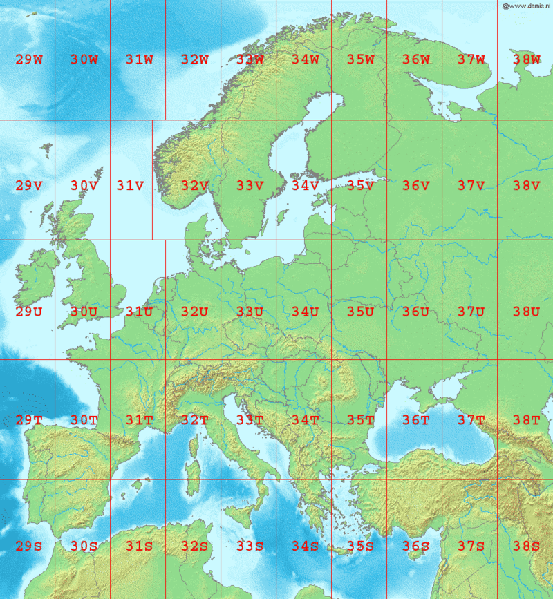

You may have noticed that our latitude and longitude columns were in a surprising unit. Universal Transverse Mercator (UTM) coordinate systems have some positive aspects that are useful, but some of the things you're going to want to do with this data, like plotting it alongside lat/lon rasters of bathymetric data, or with any other dataset that has lat/lon as its coordinates, will require conversion to 'true' latitude and longitude values. 

So let's first convert our dataset to be a spatially-aware data frame with decimal-degree latitude and longitude as its coordinate system.

~~~
# Say that stS is a copy of our seaTrout data
stS<-seaTrout

coordinates(stS)<-~lon+lat # tell stS that it's a spatial data frame with coordinates in lon and lat
proj4string(stS)<-CRS("+proj=utm +zone=33 +ellps=WGS84 +datum=WGS84 +units=m +no_defs") # in reference system UTM 33

~~~
{: .language-r}

We can find from a [UTM lookup reference](http://www.dmap.co.uk/utmworld.htm) what UTM zone we're supposed to be in. Northern Norway is UTM33, for example.  

We'd like to project this into (long, lat) - but the `spTransform()` function can take this to any projection / coordinate reference system we might need.
~~~

# Project it to a different, strange CRS.

st<-spTransform(stS, CRS("+init=epsg:28992"))   # what is epsg:28992 - https://epsg.io/28992 - netherlands/dutch topographic map in easting/northing
st<-data.frame(st)  # results aren't a data.frame by default though.
View(st)  # It knows the coords should go in lon and lat columns, but they're actually still easting/northing as per the CRS we chose.

# Project it to the CRS we want it to be:
st<-spTransform(stS, CRS("+proj=longlat +datum=WGS84")) # ok let's put it in lat/lon WGS84
st<-data.frame(st)
View(st)

~~~
{: .language-r}

So now we have a spatially-aware data frame, using lat and lon as its coordinates in the appropriate CRS. As we want to see the underlying study area, we can use the min/max values of our latitude and longitude columns to subset a world-scale dataset, or to fetch a terrain/bathymetric map from a public data source. We'll do this for the NOAA-provided ETOPO1 bathymetric data, using functions provided by a library called `marmap`.

~~~
x=.5 # padding for our data's bounds
st <- st %>% as_tibble(st) # put our data back into tibble form explicitly
bgo <- getNOAA.bathy(lon1 = min(st$lon-x), lon2 = max(st$lon+x),
                     lat1 = min(st$lat-x), lat2 = max(st$lat+x), resolution = 1) # higher resolutions are very big.

# now we have bgo, let's explore it.                    

class(bgo); # check the data type of bgo
# what's a 'bathy' object?
View(bgo)   # can't View it...
bgo         # yikes!
dim(bgo)    # ok so it's a grid, 125 x 76, with -## values representing depths 

plot(bgo)   # it plots!
plot(bgo, col="royalblue")

autoplot(bgo)  # but ggplot2::autoplot() sees its type and knows more about it
               # e.g. understands what its scale ratio ought to be.
~~~
{: .language-r}

As a housekeeping step, we'll often use `fortify` to first turn the raster into an x,y,z data.frame and then optionally `as_tibble` to make it explicitly a tibble. This makes our plotting functions happy, and works for any raster file! Here's the syntax to turn `bgo` into a x,y,z dataframe and then into a tibble.

~~~
bgo %>% fortify %>% as_tibble   
~~~
{: .language-r}

A few helper functions that we'll use for our bathymetry map can be plussed into the ggplot call.
`scale_fill_etopo()` will give us a sensible colorbar for our bathy and topographic data. and `ggplot` provides a few `theme_xxxx()` functions for pre-setting a bunch of style options.

~~~
# Let's really lay on the style with ggplot
bgo %>%
  fortify %>%
  ggplot(aes(x, y, fill=z))+
  geom_raster()   +  # raster-fy - plot to here first, see the values on a blue-scale. This isn't the fjords of Norway....
  scale_fill_etopo() +  # color in the pixels with marmap's scale_fill_etopo to see the positive values more clearly.
  labs(x="Longitude", y="Latitude", fill="Depth")+
  theme_classic()+
  theme(legend.position="top")+
  theme(legend.key.width = unit(5, "cm"))
~~~
{: .language-r}

You can save the output of your ggplot chain to a variable instead of displaying it immediately. We'll come back to this bathymetric map of our domain later on and lay some more stuff on top of it, so let's save it to bplot to make that easy on ourselves.

We're also going to plot our data points on here, just the distinct lat and lon values to avoid overplotting, but now we'll know where all our listening stations are. A point of order here. Our bathymetry has a z value in its aesthetic, but our sub-plotted receiver points don't have that! To avoid ggplot chastening us for this 'missing' positional data, we tell it we're being different with the aesthetics using `inherit.aes=F` in our call to `geom_point()`.

~~~
bplot<-bgo %>%  # Save the output of the plot call to a variable instead of showing it.
  fortify %>%  # Turn a raster into a data.frame
  ggplot(aes(x, y, z=z, fill=z))+  
  geom_raster()+       # raster-ify
  scale_fill_etopo()+  # color in the pixels
  labs(x="Longitude", y="Latitude", fill="Depth")+
  theme_classic()+
  theme(legend.position="top") + # same plot as before up to here
  geom_point(data=st %>%  # now let's add our station locations to the plot!
               as_tibble() %>%
               distinct(lon, lat), # only plot one point per lat,lon pair, not 1.5m points!
             aes(lon, lat), inherit.aes=F, pch=21, fill="red", size=2)+ # don't inherit aesthetics from the parent,
                                                                        # original map is lat/lon/depth, points without Z vals will fail to plot!
  theme(legend.key.width = unit(5, "cm"))

bplot  # now the plot is saved in bplot, show it by running just the variable name.

~~~
{: .language-r}

Hang onto `bplot` in your environment for now. We'll use it later on!

